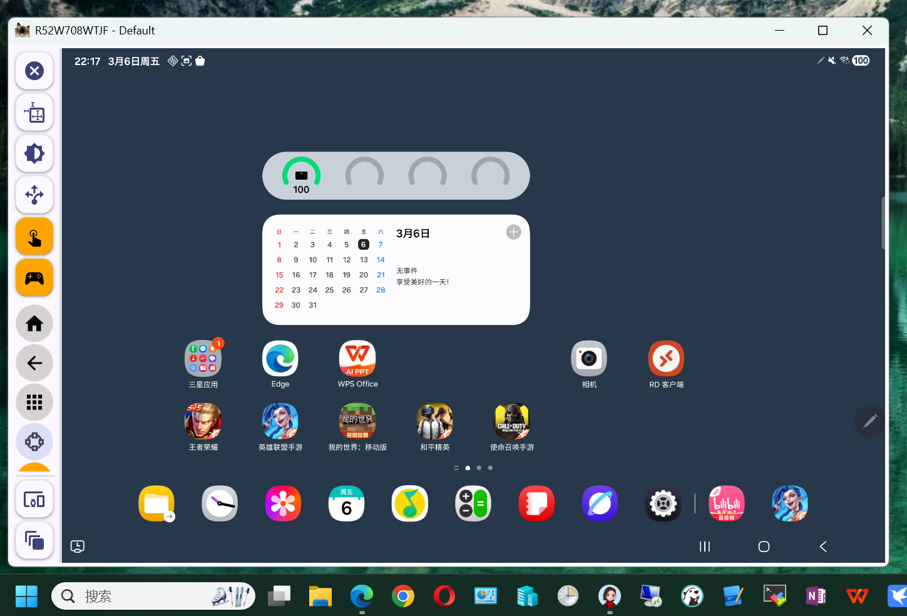
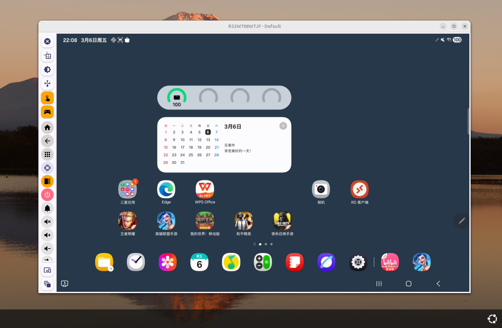
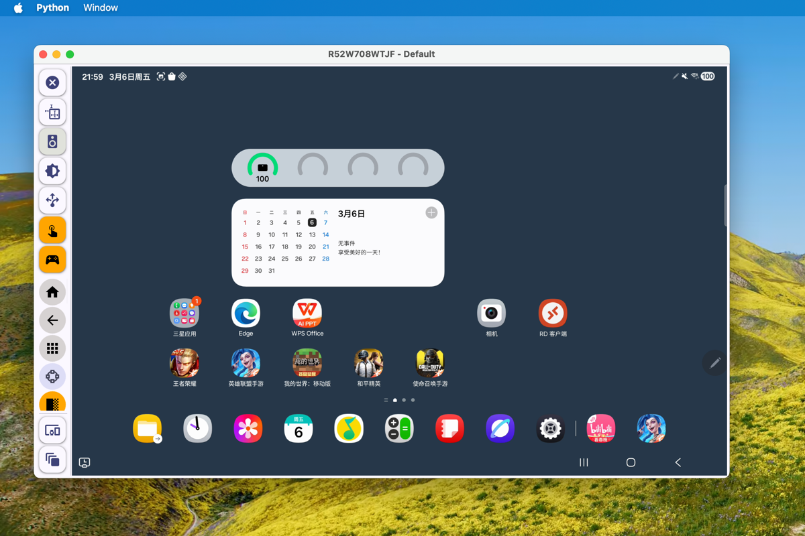
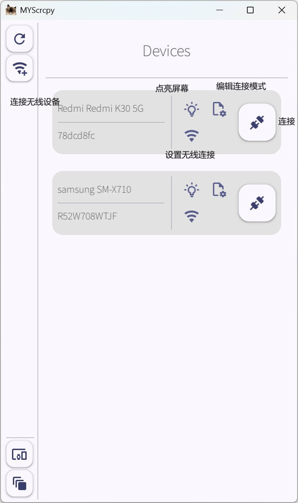
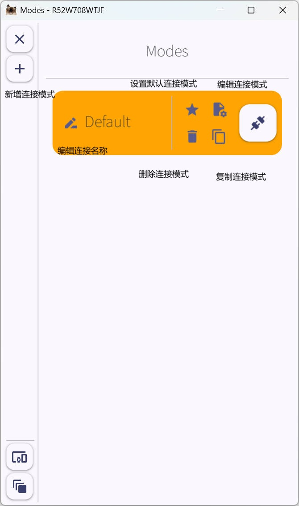
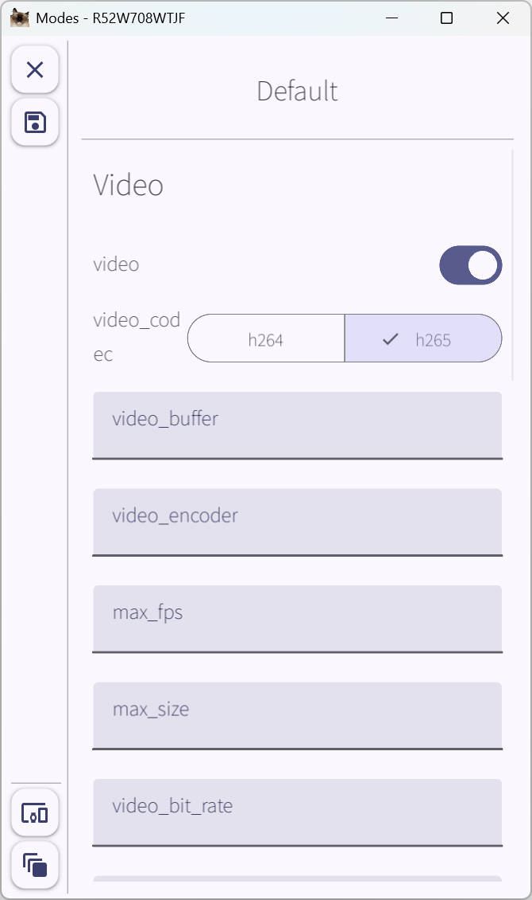
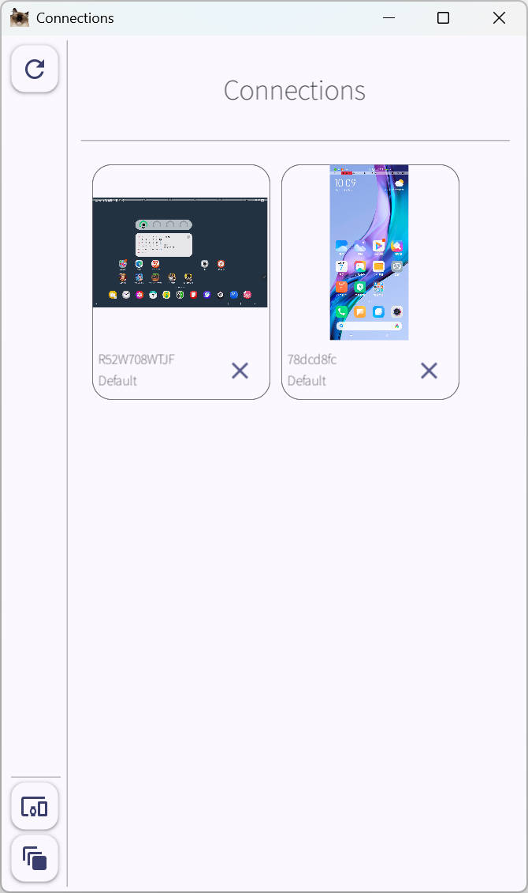
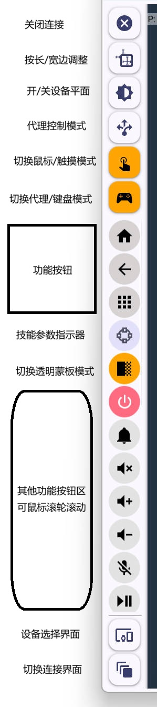
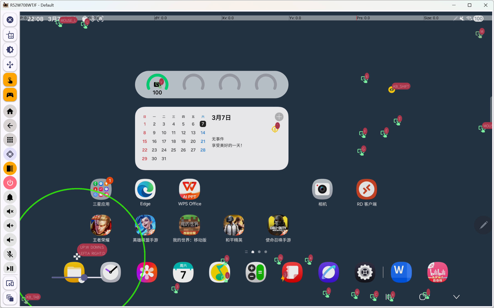

# MYScrcpy V3.3
### [中文介绍](README.md)
### A [**Scrcpy 3.3**](https://github.com/Genymobile/scrcpy/) client implemented in Python
Including complete parsing of video, audio, and control functions, developer-friendly and ready to use out of the box!

**V3.3** GUI is built with [**Kivy**](https://kivy.org/) / [**KivyMD**](https://kivymd.readthedocs.io/en/latest/) 

Featuring a modern interface design, supporting Windows/Ubuntu(X11)/MacOSX, multi-device connection, and mouse/keyboard mapping.

Windows EXE Download：[BaiduDisk](https://pan.baidu.com/s/14gDbpJKkBeVVvdIu-HTWEw?pwd=cp9f)

MD5: 7e30b64e963666b73f78f6da37e2d90d

Windows


Ubuntu


Macosx


### GUI
- Automatically remembers window size based on device and current connection parameters, while saving window position before rotation. No frequent window position adjustments needed when switching between portrait and landscape modes.
- Supports Windows/Ubuntu(X11)/MacOS X
- Supports wired and wireless device connections
- Supports configuring wireless port numbers
- Allows configuring connection modes per device and saving connection parameters
  - For example, when using the mobile camera mode, video/audio are enabled while control is disabled, and saved as a "Camera" configuration profile
  - For screen mirroring, all configurations are enabled and saved as a "Screen Mirroring" configuration profile

### Video
- Supports H264/H265 video stream decoding
- Supports proportional window resizing
  - Free scaling by dragging the window
  - Automatic window adjustment to video aspect ratio based on height/width

### Audio
- Supports Opus/FLAC/Raw formats
- Supports selecting playback devices

### Control
- **NEW** Mask mode added in V3.3
- Optimized mouse controller
- Toggle between UHID/Touch mode using the middle mouse button
- Right-click function selector support
- New keyboard switcher - press F8 to toggle between UHID/Ctrl modes
- Key mapping creation tool supporting multiple control mapping methods (keyboard, mouse, etc.), compatible with Windows/Ubuntu(X11)/MacOS X
- UHID mouse support for seamless mouse integration between Android interface and PC
- UHID-Keyboard support for simulating external keyboards, enabling direct Chinese input (tested with Baidu and Sogou input methods)
- Mouse wheel scrolling and zooming functions
- Support for creating a second virtual point to simulate two-finger operations with left-click
- Multiple function keys in the sidebar

## Help and Support
For any questions, ideas, or suggestions during use, feel free to contact me through:
#### QQ Group: 579618095


#### Email: Me2sY@outlook.com
#### Blog: [CSDN](https://blog.csdn.net/weixin_43463913)

## Basic Usage
### 1.1 PyPI Installation
**Note: Versions above V3.2.X use KivyMD 2.X which requires manual installation**

[KivyMD getting-started](https://kivymd.readthedocs.io/en/latest/getting-started/)

```bash
运行
uv add mysc

# Versions above V3.2 use KivyMD 2.X, which requires manual installation
uv add https://github.com/kivymd/KivyMD/archive/master.zip
```

### 1.2 Clone this project (managed with uv)
```bash
uv sync
```

### 2. Project Structure:
Note! V3.3 has significant architectural changes compared to V3.2, retaining only the Kivy GUI while optimizing Core classes and methods
1. **utils**
Defines basic utility classes and various parameters
2. **gui**
Kivy/KivyMD interface implementation, including video rendering, mouse events, UHID mouse/keyboard input, mapping editing, etc.
3. **core**
Core packages for Session, Connection, video stream, audio stream, control stream, device controller, etc.
4. **libs**
Fonts and Scrcpy server package
5. **locales**
Internationalization (in progress)
6. **statics**
Static files

### 3.Program Integration for Custom Development
Obtaining video stream (similar for audio and control):
```python
from adbutils import adb

from mysc.core.video import VideoAdapter, VideoKwargs

device = adb.device_list()[0]

# Define video adapter
va = VideoAdapter(
    # Define connection parameters
    VideoKwargs(
        video_codec=VideoKwargs.EnumVideoCodec.H264,
        max_fps=30
    )
)

# Initiate connection
va.connect(device)

while True:
    
    # Pillow Image
    pil_img = va.get_image()
    
    # RGB np.ndarray
    data = va.get_ndarray(frame_format='rgb24')
    
    # Custom logic implementation

# Close connection
va.disconnect()
```
### 4. Using the GUI
:exclamation: On Linux systems like Ubuntu, portaudio must be installed first to use pyaudio
```bash
sudo apt install build-essential python3-dev ffmpeg libav-tools portaudio19-dev
```

Launch the program
```bash
mysc

or

python -m mysc.run
```

#### Interface Introduction
**Device Selection Interface**



**Connection Mode Selection Interface**



**Connection Mode Editing Interface**



**Connection Switching Interface**



**Sidebar Functions**



**Control Proxy (Mapping) Interface**

After entering edit mode, a control mapping button is added to the right-click menu. Supports FPS mode, skill release mode (using skill parameter indicator to get parameters), mouse movement mode, etc.


## Acknowledgements
Special thanks to the [**Scrcpy**](https://github.com/Genymobile/scrcpy/) project and its author [**rom1v**](https://github.com/rom1v) - this project is built upon this excellent foundation.

Thanks to the Kivy/KivyMD and other outstanding GUI frameworks.

Thanks to all the package projects and their authors used in this project. Your contributions have created such a great software development environment.

Also thanks to all users - thank you for your support and help. We hope MYScrcpy becomes a handy tool for your daily work and study.

## Disclaimer
This project is intended for daily learning (graphics, audio, AI training, etc.), Android testing, and development purposes.
**Please note:**
1. Enabling USB debugging mode on mobile phones carries certain risks, potentially leading to data leakage and other security issues. Ensure you understand and can mitigate these risks before use.
2. **This project must not be used for illegal or criminal activities.**

**The author and this project are not responsible for any consequences arising from the above uses. Please use discretion.**

## Historical Versions
[V3.2 - V1.7 README.md](files/old_version/README.md)

[V3.2 - V1.7 README_EN.md](files/old_version/README_EN.md)